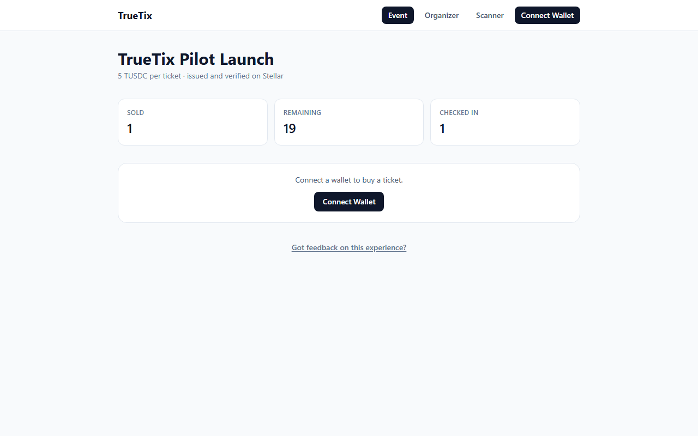
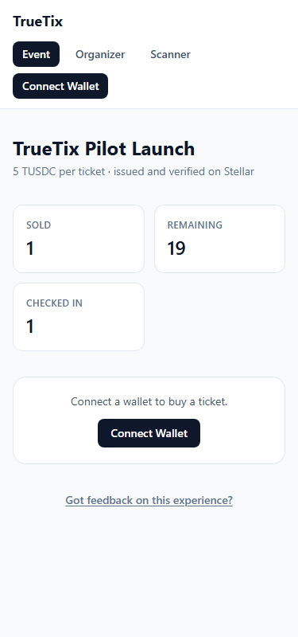
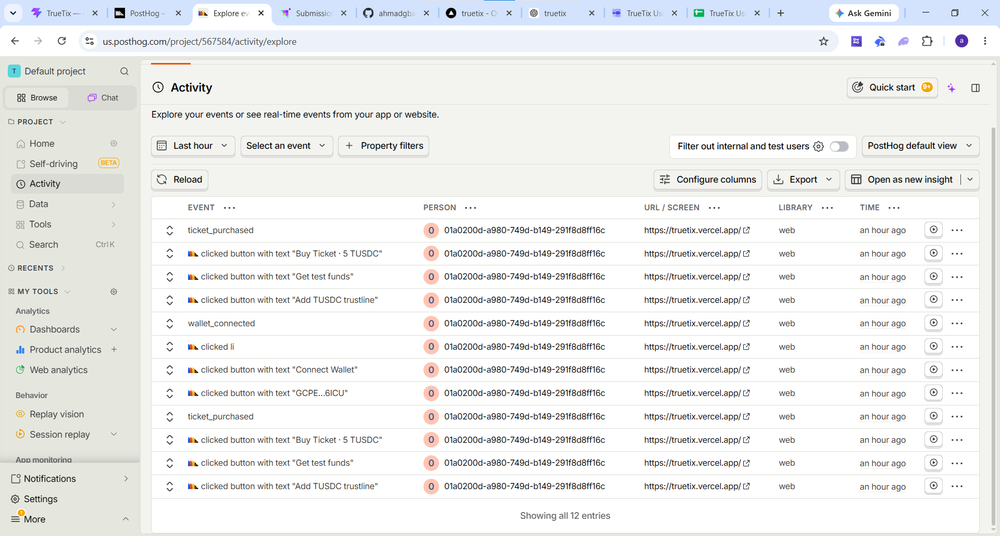

# TrueTix

On-chain event ticketing on Stellar. A ticket is a Soroban contract entry, not a PDF or a
screenshot: it can't be duplicated, and once an event sells out, the contract itself refuses
to mint another one. Built for the Level 4 (Green Belt) production MVP milestone.

## The problem

Paper and PDF tickets in emerging-market event scenes (Nigeria, and similar markets) are
trivial to forge, and popular events get bought up by resellers who mark up prices 3-5x with
organizers seeing none of it. TrueTix fixes both: authenticity is a signature check, not
trust in a printed barcode, and scarcity is enforced by a smart contract instead of an
organizer's word.

## What's built (MVP scope)

- **Event creation** — an organizer connects a wallet and mints a fixed batch of tickets for
  one event (name, price, supply).
- **Ticket purchase** — an attendee connects a wallet, pays in a Stellar-native token, and
  the contract transfers a ticket out of the organizer's remaining supply.
- **Door check-in** — a scanner view looks up a wallet address and marks its ticket used;
  the contract rejects a second check-in of the same ticket.
- **Supply enforcement** — `buy_ticket` hard-fails once `tickets_sold == total_supply`, on
  chain, not just in the UI.
- **Organizer visibility** — a live dashboard of tickets sold / remaining / checked-in.

Resale-price-cap enforcement, multi-event support, and fiat on/off-ramp are mainnet-vision
items from the original proposal, intentionally out of scope for this MVP.

## Architecture

```
                     ┌─────────────────────────┐
                     │   Soroban contract       │
                     │   (contracts/ticketing)  │
                     │                           │
                     │  mint_tickets  buy_ticket │
                     │  check_in      get_event  │
                     └────────────┬──────────────┘
                                  │ invoke / simulate (Soroban RPC)
                     ┌────────────┴──────────────┐
                     │   React frontend (Vite)    │
                     │                             │
   /            ─────┤  EventPage   (attendee)     │
   /organizer   ─────┤  OrganizerDashboard          │
   /scanner     ─────┤  Scanner     (door check-in) │
                     │                             │
                     │  Stellar Wallets Kit         │
                     │  (Freighter/xBull/Rabet/...) │
                     │  React Query · PostHog        │
                     └────────────┬──────────────┘
                                  │
                     ┌────────────┴──────────────┐
                     │  /api/faucet (Vercel fn)    │
                     │  grants test TUSDC to new    │
                     │  testers after they add a    │
                     │  trustline                   │
                     └─────────────────────────────┘
```

Payment runs on **TUSDC**, a test Stellar asset issued specifically for this pilot and
wrapped as a Soroban Asset Contract (SAC), rather than depending on an external testnet USDC
issuer outside our control. See [docs/DEPLOYMENT.md](docs/DEPLOYMENT.md) for exact addresses
and how the faucet fits into onboarding.

## Tech stack

- **Contract**: Rust, `soroban-sdk` 26, deployed to Stellar testnet.
- **Frontend**: React 19, TypeScript, Vite, Tailwind CSS v4.
- **Wallet**: `@creit.tech/stellar-wallets-kit` (Freighter, xBull, Rabet, Albedo, Lobstr).
- **Data**: `@tanstack/react-query` for all contract reads (loading/error/refetch states).
- **Analytics/monitoring/feedback**: PostHog (product analytics, exception autocapture, an
  in-app feedback widget).
- **Hosting**: Vercel (static frontend + one serverless faucet function).

## Repo layout

```
contracts/ticketing/     Soroban contract (src/lib.rs) + unit tests (src/test.rs)
frontend/                Vite/React app
  src/pages/              EventPage, OrganizerDashboard, Scanner
  src/components/         Layout, WalletButton, StatTile, TicketCard, FeedbackButton, ErrorBoundary
  src/hooks/               useWallet, useEvent, useMyTickets, useTusdcStatus
  src/lib/                 env config, contract client, wallet kit setup, TUSDC helpers, PostHog init
  src/contracts/ticketing-client/  generated TS bindings for the deployed contract
  api/faucet.ts            Vercel serverless function: grants test TUSDC
docs/
  DEPLOYMENT.md            deployed addresses + exact deploy commands
  ONBOARDING.md            script for running the 10-tester pilot
  screenshots/             UI screenshots for submission
```

## Running locally

```bash
# Contract tests
cd contracts/ticketing
cargo test

# Frontend
cd frontend
npm install
npm run dev
```

The frontend ships with working testnet defaults baked in (see `frontend/src/lib/env.ts`),
so `npm run dev` talks to the live pilot deployment with no `.env` needed. Copy
`frontend/.env.example` to `.env` only to point at a different deployment or to set a
PostHog key.

## Deployed contract (Stellar testnet)

| Item | Address |
|---|---|
| Ticketing contract | `CDKFKC4N6M6SRABEX4SH34SP56FZE665HRR3K4ZS5TQBFDYMHPB4J7B6` |
| TUSDC asset contract (SAC) | `CB63M3HDCPISDPFIS6PF7ORYGQSBD437ICSQUO4434YA3ANIDU2HCNEM` |
| TUSDC issuer | `GDPYVBTKFUYFYXRXPK6I6J3ZA6TZRII4DD2UDPSQHCFPVFADQ4UOOKN3` |
| Organizer | `GAREKY23A3ILCAUM3KEP3AWFGD6V7UVQS34ESSOIXFJ5LXLZ6YSSNPKC` |

Full deployment log, including how the event was initialized, is in
[docs/DEPLOYMENT.md](docs/DEPLOYMENT.md).

## Screenshots

Event page (desktop) — live on-chain stats, buy flow:



Event page (mobile, 375px):



Organizer dashboard and door scanner are in [docs/screenshots/](docs/screenshots/).

Analytics/monitoring (PostHog Activity, capturing real production events):



## Demo Video

[Watch the TrueTix demo on Loom](https://www.loom.com/share/91019546636c4587a8d6d7cd4a4102ec) —
walkthrough of the full flow: organizer dashboard, attendee wallet connect and ticket
purchase, door scanner check-in, and the resulting live stats.

## Live demo / user pilot

See [docs/ONBOARDING.md](docs/ONBOARDING.md) for the step-by-step script used to run the
10-tester pilot, how the faucet removes the "get testnet USDC" friction, and where feedback
lands.
